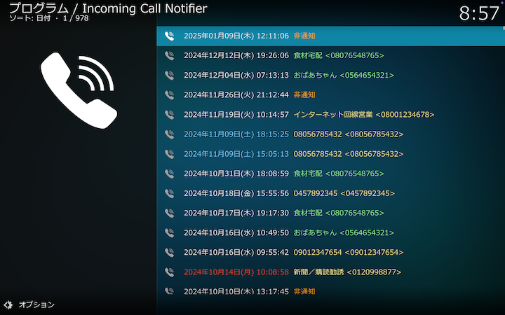

## Kodiアドオン：ネットラジオクライアント

ひかり電話などのIP電話への着信を通知します。
着信時に、発信元をKodiの通知（Notification）機能を使ってKodi画面上に表示します。
電話帳にない発信元番号はウェブ検索され、検索結果を発信元として通知します。
着信時にテレビをKodi画面に強制的に切り替えて通知を受けることができます。

macOS、Raspberry Pi OSで動作検証しています。

 

## 目次

[概要](docs/0_概要.md)

[着信履歴（起動画面）](docs/1_着信履歴（起動画面）.md)

[電話帳](docs/2_電話帳.md)

[アドオン設定（SIP設定）](docs/3_アドオン設定（SIP設定）.md)

[アドオン設定（電話帳）](docs/4_アドオン設定（電話帳）.md)

[アドオン設定（その他）](docs/5_アドオン設定（その他）.md)
