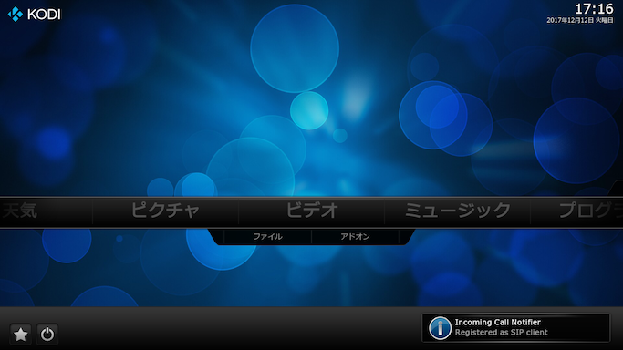
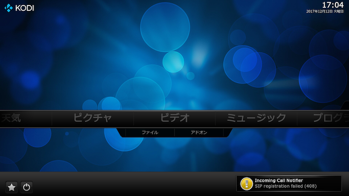

## 概要

ひかり電話などのIP電話への着信を通知します。 
着信時に、発信元をKodiの通知（Notification）機能を使ってKodi画面上に表示します。
電話帳にない発信元番号はウェブ検索され、検索結果を発信元として通知します。
着信時にテレビをKodi画面に強制的に切り替えて通知を受けることができます。

## 外部プログラムのインストール

IP電話ルータ等のSIPサーバと通信するためにpjsua2.pyを事前にインストールしてください。インストール後、[アドオン設定（SIP設定）](3_アドオン設定（SIP設定）.md#pjsuapy2のパス)でpjsua2.pyのパスを指定してください。

pjsua2.pyのインストール手順は[こちら](https://www.pjsip.org/docs/book-latest/html/intro_pjsua2.html#building-pjsua2)。
configureは--enable-sharedオプションなしで実行してください。

<pre>
./configure
make dep
make
cd pjsip-apps/src/swig
make
make install
</pre>

pjsua2.pyのパスは、pjsua2.pyをインストールしたPCで以下のpythonコードを実行して確認できます。

<pre>
import pjsua2
print(pjsua2.__file__)
</pre>

## LINEによる着信通知について

LINE Notifyサービスが2025年3月31日をもって[サービス終了](https://notify-bot.line.me/closing-announce)したため、アドオンによるLINE通知のサポートは終了しました。LINEに着信を通知するには、LINE側の[Messaging API](https://developers.line.biz/ja/services/messaging-api/)との間を仲介するサーバアプリをユーザ側で用意する必要があります。

## 起動時の通知

[外部プログラムをインストール](0_概要.md#外部プログラムのインストール)して、[アドオン設定（SIP設定）](3_アドオン設定（SIP設定）.md)を行った後、Kodi本体を再起動してください。IP電話ルータ等のSIPサーバとの通信に問題がなければ、Kodi本体起動後に"Registered as SIP client"の通知がなされます。

SIPサーバとの通信に問題がある場合は"SIP registration failed ( _nnn_ )"の通知がなされます。カッコ内に表示されるSIPステータスコード _nnn_ を手がかりとして、[アドオン設定（SIP設定）](3_アドオン設定（SIP設定）.md)、SIPサーバの設定等を確認してください。

## 発信元番号検索

発信元番号は以下の順番に検索されます。

* 電話帳
* キャッシュ
* ウェブ

### 電話帳

番号とこれに対応する名前を電話帳として管理しています。
[着信履歴のコンテクストメニュー](1_着信履歴（起動画面）.md#コンテクストメニュー)から[電話帳](2_電話帳.md)を表示できます。
電話帳への登録は[アドオン設定（電話帳）](4_アドオン設定（電話帳）.md)をご覧ください。
[着信履歴のコンテクストメニュー](1_着信履歴（起動画面）.md#コンテクストメニュー)から電話帳へ登録することもできます。

### キャッシュ

電話帳にない発信元番号はウェブ検索されますが、その結果はキャッシュに保存され、次に同じ番号から着信があった場合、ウェブ検索することなく保存されている情報を表示します。
キャッシュのクリアは[アドオン設定（その他）](5_アドオン設定（その他）.md#キャッシュをクリアする)をご覧ください。

### ウェブ

電話帳やキャッシュにない発信元番号は[電話帳ナビ（www.telnavi.jp）](https://www.telnavi.jp)で発信元番号が検索されます。
検索結果はキャッシュに保存され、次に同じ番号から着信があった場合、ウェブ検索することなく保存されている情報を表示します。

ウェブ検索については以下にご注意ください。

* ウェブ検索時には発信元番号が検索先に通知されます。
* ウェブ検索は検索先サイトの利用条件にしたがってください。番号検索スクリプトを指定しない場合は[電話帳ナビ（www.telnavi.jp）](https://www.telnavi.jp)で発信元番号が検索されます。同サイトの[サイト利用規約](https://www.telnavi.jp/agreement/)、[免責事項](https://www.telnavi.jp/qualification/)、[個人情報保護方針](https://www.telnavi.jp/privacy/)に同意の上でご利用ください。
