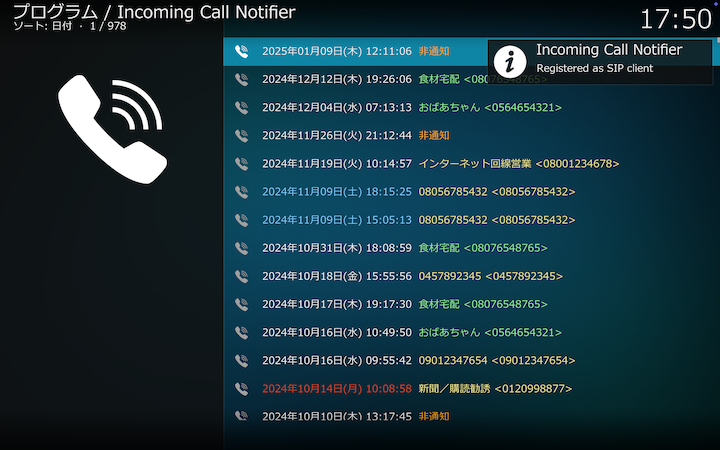
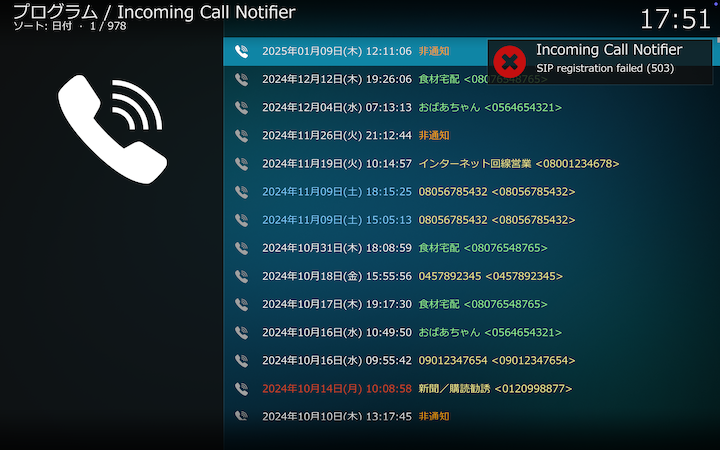

## 概要

ひかり電話などのIP電話への着信を通知します。 
着信時に、発信元をKodiの通知（Notification）機能を使ってKodi画面上に表示します。
電話帳にない発信元番号はウェブ検索され、検索結果を発信元として通知します。
着信時にテレビをKodi画面に強制的に切り替えて通知を受けることができます。

 

## 外部プログラムのインストール

IP電話ルータ等のSIPサーバと通信するためにpjsua2.pyを事前にインストールしてください。
インストール後、[アドオン設定（SIP設定）](3_アドオン設定（SIP設定）.md#pjsuapy2のパス)でpjsua2.pyのパスを指定してください。

pjsua2.pyのソース、インストール等の詳細情報は[こちら](https://docs.pjsip.org/en/latest/index.html)。
configureは--enable-sharedオプションなしで実行します。
macOS、Raspberry Pi OSでは、リポジトリをクローンした後、以下のコマンドを順に実行してビルドしました。

<pre>
./configure
make dep
make
make install
cd pjsip-apps/src/swig
make
make install
</pre>

pjsua2.pyのパスは、上記にしたがってpjsua2.pyをインストールしたPCで以下のpythonコードを実行して確認できます。

<pre>
import pjsua2
print(pjsua2.__file__)
</pre>

 

## LINEによる着信通知について

LINE Notifyサービスが2025年3月31日をもって[サービス終了](https://notify-bot.line.me/closing-announce)したため、アドオンによるLINE通知のサポートは終了しました。LINEに着信を通知するには、LINE側の[Messaging API](https://developers.line.biz/ja/services/messaging-api/)との間を仲介するサーバアプリをユーザ側で用意する必要があります。

 

## 起動時の通知

[外部プログラムをインストール](0_概要.md#外部プログラムのインストール)して、[アドオン設定（SIP設定）](3_アドオン設定（SIP設定）.md)を行った後、Kodi本体を再起動してください。IP電話ルータ等のSIPサーバとの通信に問題がなければ、Kodi本体起動後に _Registered as SIP client_ の通知がなされます。

SIPサーバとの通信に問題がある場合は _SIP registration failed (nnn)_ の通知がなされます。カッコ内に表示される[SIPステータスコード](#SIPステータスコード) _nnn_ を手がかりとして、[アドオン設定（SIP設定）](3_アドオン設定（SIP設定）.md)、SIPサーバの設定等を確認してください。以下はPCのネットワーク接続が切れてSIPサーバにアクセスできない場合のエラー通知です。

 

## SIPステータスコード

クリックすると一覧が表示されます

1xx = 情報応答

| code | status |
|:----:|:-------|
|100|試行中|
|180|呼び出し中|
|181|転送中|
|182|順番待ち|
|183|セッション進行中|

2xx = 成功応答

| code | status |
|:----:|:-------|
|200|OK|
|202|受諾：照会に使用|

3xx = リダイレクト応答

| code | status |
|:----:|:-------|
|300|複数の転送先|
|301|永久的に移動|
|302|一時的に移動|
|305|プロキシ使用|
|380|ほかのサービス|

4xx = リクエスト エラー

| code | status |
|:----:|:-------|
|400|不正なリクエスト|
|401|認証が必要：レジストラのみ利用可。プロキシは「プロキシ認証 407」が必要|
|402|支払いが必要（将来使われる可能性あり）|
|403|禁止|
|404|見つかりません：ユーザが見つかりません|
|405|メソッド利用不可|
|406|容認不可|
|407|プロキシ認証が必要|
|408|リクエスト タイムアウト：時間内にユーザが見つかりませんでした|
|410|不在：ユーザは過去に存在しましたが、もうここにはいません|
|413|リクエスト本体が大きすぎます|
|414|リクエストURIが大きすぎます|
|415|非対応メディア|
|416|非対応URIスキーム|
|420|不正な拡張：ＳＩＰプロトコル拡張がサーバに認識されません|
|421|拡張が必要|
|423|間隔が短すぎます|
|480|一時的に利用不可|
|481|通話 / トランザクションが存在しません|
|482|ループ検出|
|483|最大ホップ数超過|
|484|不完全なアドレス|
|485|あいまい|
|486|話し中|
|487|リクエストが中止|
|488|ここでは容認不可|
|491|リクエスト待機中|
|493|解読不可：S/MIME本文を解読できませんでした|

5xx = サーバー エラー

| code | status |
|:----:|:-------|
|500|サーバ内部エラー|
|501|非実装：SIPリクエスト メソッドが実装されていません|
|502|不正なゲートウェイ|
|503|サービス利用不可|
|504|サーバタイムアウト|
|505|バージョン非対応：サーバはこのSIPバージョンに対応していません|
|513|メッセージが大きすぎます|

6xx = グローバル エラー

| code | status |
|:----:|:-------|
|600|随所で話し中|
|603|拒否|
|604|どこにも存在しません|
|606|容認不可|

 

## 発信元番号検索

発信元番号は以下の順番に検索されます。

* 電話帳
* キャッシュ
* ウェブ

### 電話帳

番号とこれに対応する名前を電話帳として管理しています。
[着信履歴のコンテクストメニュー](1_着信履歴（起動画面）.md#コンテクストメニュー)から[電話帳](2_電話帳.md)を表示できます。
電話帳への登録は[アドオン設定（電話帳）](4_アドオン設定（電話帳）.md)をご覧ください。
[着信履歴のコンテクストメニュー](1_着信履歴（起動画面）.md#コンテクストメニュー)から電話帳へ登録することもできます。

### キャッシュ

電話帳にない発信元番号はウェブ検索されますが、その結果はキャッシュに保存され、次に同じ番号から着信があった場合、ウェブ検索することなく保存されている情報を表示します。
キャッシュのクリアは[アドオン設定（その他）](5_アドオン設定（その他）.md#キャッシュをクリアする)をご覧ください。

### ウェブ

電話帳やキャッシュにない発信元番号は[電話帳ナビ（www.telnavi.jp）](https://www.telnavi.jp)で発信元番号が検索されます。
検索結果はキャッシュに保存され、次に同じ番号から着信があった場合、ウェブ検索することなく保存されている情報を表示します。

ウェブ検索については以下にご注意ください。

* ウェブ検索時には発信元番号が検索先に通知されます。
* ウェブ検索は検索先サイトの利用条件にしたがってください。番号検索スクリプトを指定しない場合は[電話帳ナビ（www.telnavi.jp）](https://www.telnavi.jp)で発信元番号が検索されます。同サイトの[サイト利用規約](https://www.telnavi.jp/agreement/)、[免責事項](https://www.telnavi.jp/qualification/)、[個人情報保護方針](https://www.telnavi.jp/privacy/)に同意の上でご利用ください。
