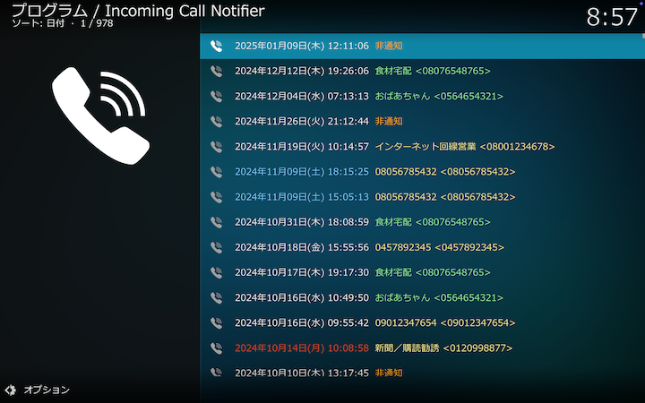
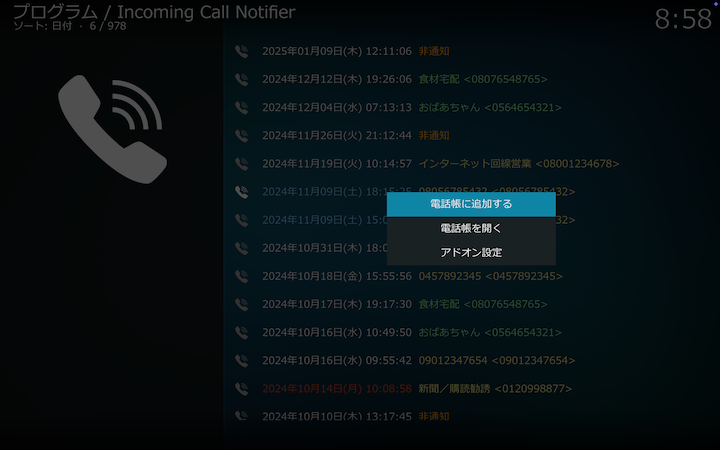

## 着信履歴

着信履歴を、左から着信日時、発信者名、発信元電話番号の順に表示します。
発信者名は、発信元電話番号をキーとして、電話帳、キャッシュ、ウェブの順に検索して最初にヒットしたものを表示します。
詳しくは、[発信元番号検索](Home#発信元番号検索)をご覧ください。

発信者名は、発信元電話番号が電話帳に登録されている場合は緑色、電話帳には登録されておらず、キャッシュまたはウェブでヒットした場合は黄色で表示されます。

***

## 着信履歴のコンテクストメニュー

### 電話帳を編集する／電話帳に追加する

コンテクストメニューでは、発信元電話番号が電話帳に登録されている場合（選択した着信履歴が緑色で表示されている場合）は「電話帳を編集する」、それ以外の場合（選択した着信履歴が黄色で表示されている場合）は「電話帳に追加する」と表示されます。
選択している着信履歴の情報を引き継いで[電話帳設定画面](4.アドオン設定（電話帳）)を表示します。

### 電話帳を開く

[電話帳](2.電話帳)を表示します。

### アドオン設定

[アドオン設定画面](3.アドオン設定（SIP設定）)を表示します。
