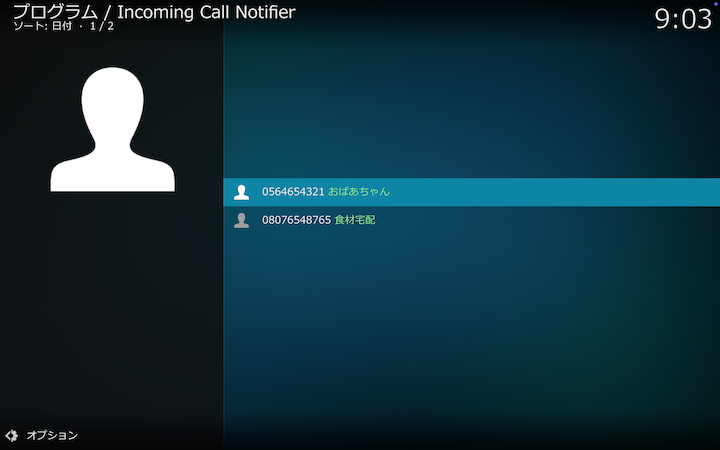
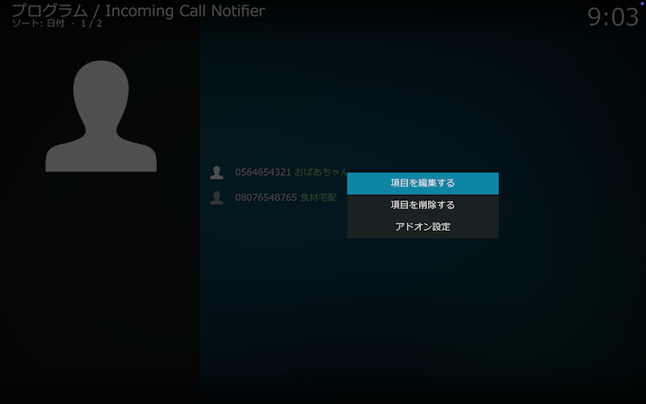

## 電話帳

発信元電話番号に対して表示する表示名を管理します。

 

## 電話帳のコンテクストメニュー

## 項目を編集する

選択している項目の情報を引き継いで[電話帳設定画面](4.アドオン設定（電話帳）.md)を表示します。

## 項目を削除する

選択している項目を削除します。

## アドオン設定

[アドオン設定画面](3.アドオン設定（SIP設定）.md)を表示します。
