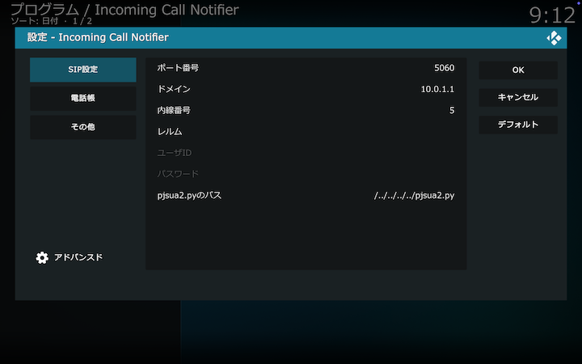
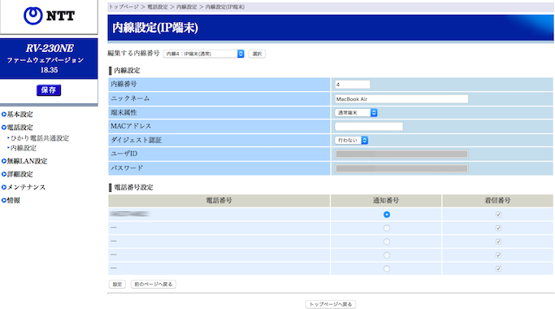

## SIP設定

### ポート番号

SIPメッセージの送受信を行うポート番号。デフォルト値は _5060_ 。

### ドメイン名

SIPサーバのドメイン名。デフォルト値は _192.168.1.1_ 。

### 内線番号

SIPサーバが本アドオンに割り当てる内線番号。SIPサーバの設定値を設定してください。

### レルム

ダイジェスト認証を行う場合設定してください。
ひかり電話ルータRV-230NEの場合は _RV230NE_ を設定してください。

### ユーザID

ダイジェスト認証を行う場合、SIPサーバが本アドオンに割り当てるユーザIDを設定してください。

### パスワード

ダイジェスト認証を行う場合、上記ユーザIDに対応するパスワードを設定してください。

### pjsua2.pyのパス

pjsua2.pyのパスを設定してください。
[外部プログラムのインストール](0.概要.md#外部プログラムのインストール)を参照してください。

 

## SIPサーバ設定例

SIPサーバの設定例として、ひかり電話ルータRV-230NEの内線設定の例を示します。

* 内線番号：4（接続されている他の端末と重複しない番号を設定します）
* ニックネーム：MacBook Air（任意の名前を設定できます）
* 端末属性：通常端末
* MACアドレス：（※１）
* ダイジェスト認証：行わない（※２）

（※１）セキュリティ等の理由で設定する場合はKodiが動作するPCのMACアドレスを設定します。

（※２）セキュリティ等の理由でダイジェスト認証を行う場合は、内線設定でユーザID、パスワードを設定します。
アドオン設定（SIP設定）にも、同じユーザID、パスワードを設定し、さらにレルムとして
`RV230NE`
を設定します。
