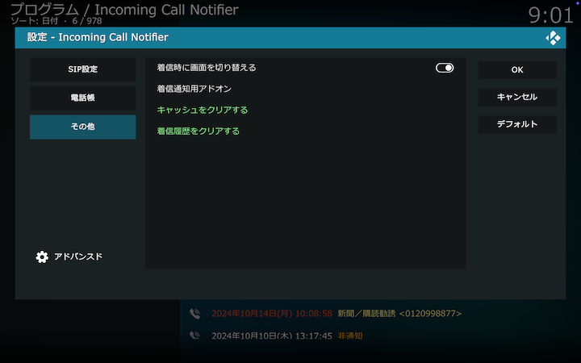

## その他

### 表示時間

Kodiの通知（Notification）機能によって発信元番号をKodi画面上に表示する秒数を指定します。

### HDMI-CEC

着信時にKodiとHDMIを介して接続されたテレビをアクティブにして、画面を強制的に切り替えます。
PCがCECに対応していない場合は、[USB-CEC Adapter](https://kodiful.com/#usbcec)が必要です。

### キャッシュをクリアする

ウェブ検索結果を消去します。
電話帳にない番号から着信があった場合は改めてウェブ検索を行い、結果を新たにキャッシュします。

### 着信履歴をクリアする

着信履歴を消去します。
