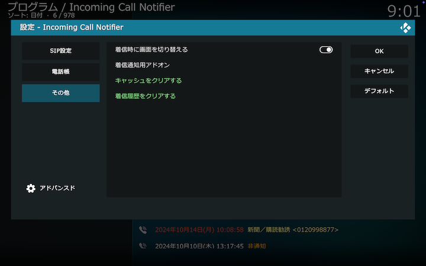

## その他

### 着信時に画面を切り替える

着信時にKodiとHDMIを介して接続されたテレビの画面を本アドオンの画面に強制的に切り替えます。
PCがCECに対応していない場合は[USB-CEC Adapter](https://kodiful.com/#usbcec)が必要です。

### 着信通知用アドオン

LINE等の外部サービスに通知するためのアドオンを指定します。
今後のアドオン開発で使用する予定です。
現時点では設定がないままにしてください。

### キャッシュをクリアする

ウェブ検索結果を消去します。
電話帳にない番号から着信があった場合は改めてウェブ検索を行い、結果を新たにキャッシュします。

### 着信履歴をクリアする

着信履歴を消去します。
